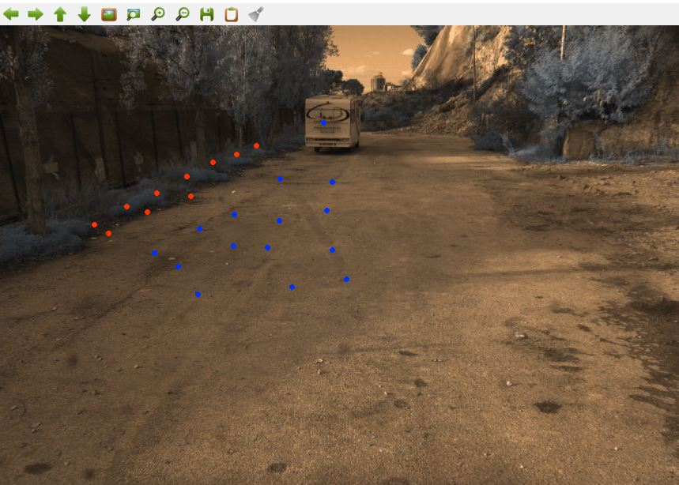

# Segment-Anything-Model-SAM-Point-prompt-Made-Easy-for-Segmentation-Mask
This is a made easy code for starters who want to use point prompt for recently released ground breaking foundational model Segment anything (SAM) by Meta AI. This code is to make easy to jump in a project where you can select point then apply to a directory and then evaluate on binary ground truth mask. You will also get binary mask from the code. 
The code will output binary segmented masks in folder. In 'outputs_prompt' named folder there will be masks based on **point prompt segmentation** and in the 'outputs_auto' there will be masks based on **automatic segmentation**. 


Organization of input image directory:
```
img/
     img1.jpg
     img2.jpg
     img3.jpg
     img4.jpg
     ...

gt/
     img1.jpg
     img2.jpg
     img3.jpg
     img4.jpg
     ...
```

The prompt needs to be enter by clicking mouse where **Left click** is for **Foreground** (BLUE DOT) and **Right click** is for **background**(RED DOT). Like the below image one has to put point prompt in the image.


# Getting Started
1. First run the git clone
```bash
git clone https://github.com/facebookresearch/segment-anything.git
```
2. Secondly, download the weight file from the main [repo](https://github.com/facebookresearch/segment-anything#model-checkpoints), or download in colab by 
```bash
!wget https://dl.fbaipublicfiles.com/segment_anything/sam_vit_h_4b8939.pth -O sam_vit_h.pth
!wget https://dl.fbaipublicfiles.com/segment_anything/sam_vit_b_01ec64.pth -O sam_vit_b.pth
```
3. Thirdly, organize the desired dataset like above mentioned structure.
4. Then, run the code 
```bash
python sam_with_widget.py
```
N.B: For inputting other arguments like: input images folder name, groundtruth folder name, put
```bash
python sam_with_widget.py -i input_folder -g groundtruth_folder 
```

## Acknowledgement 
* https://github.com/facebookresearch/segment-anything
* https://learnopencv.com/segment-anything/
